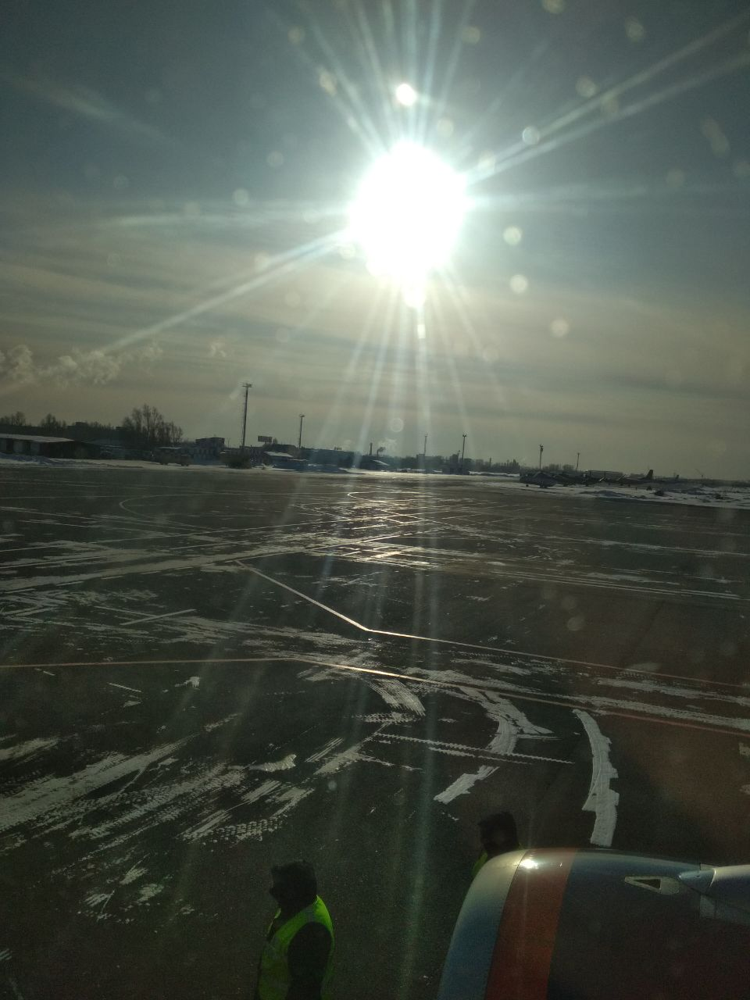
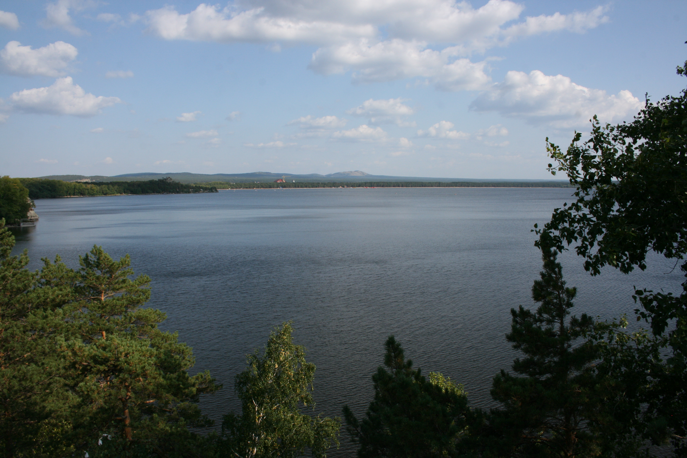
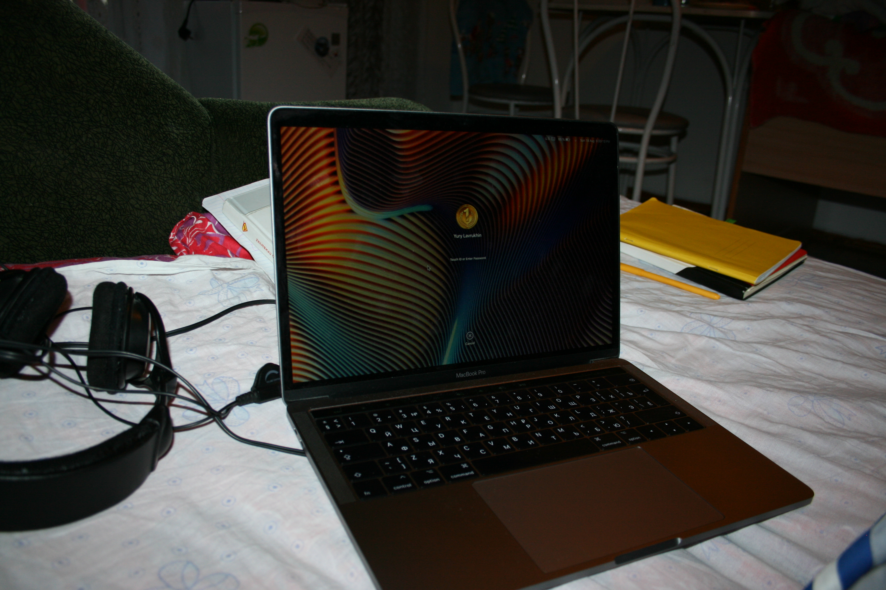
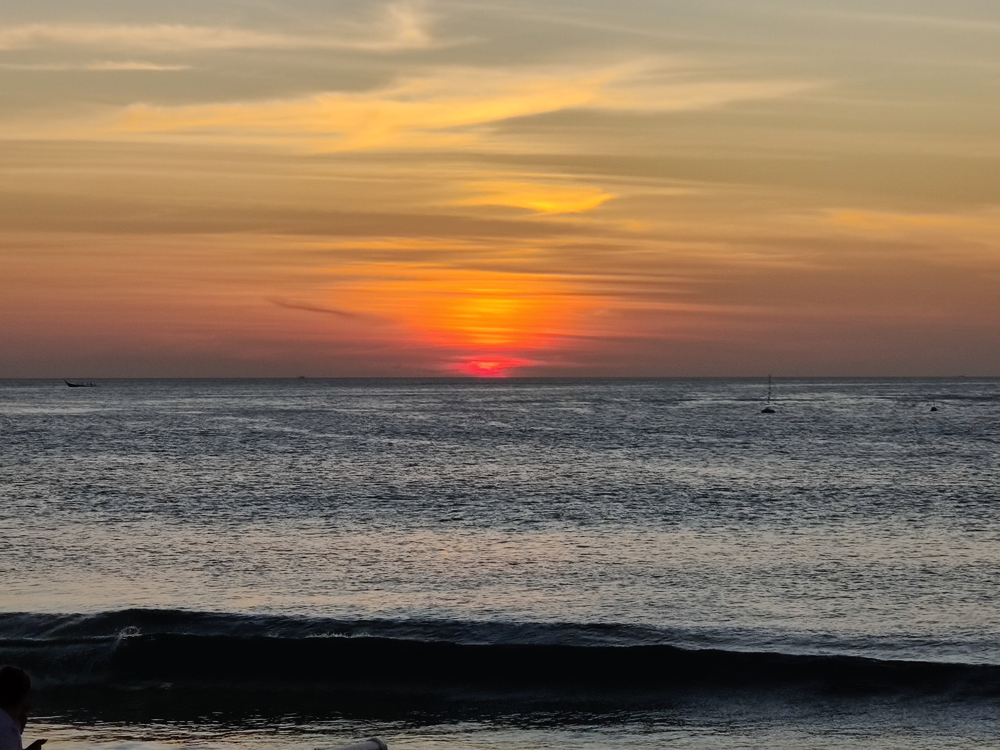
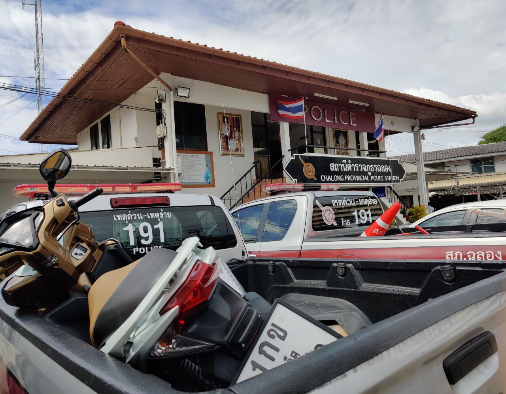
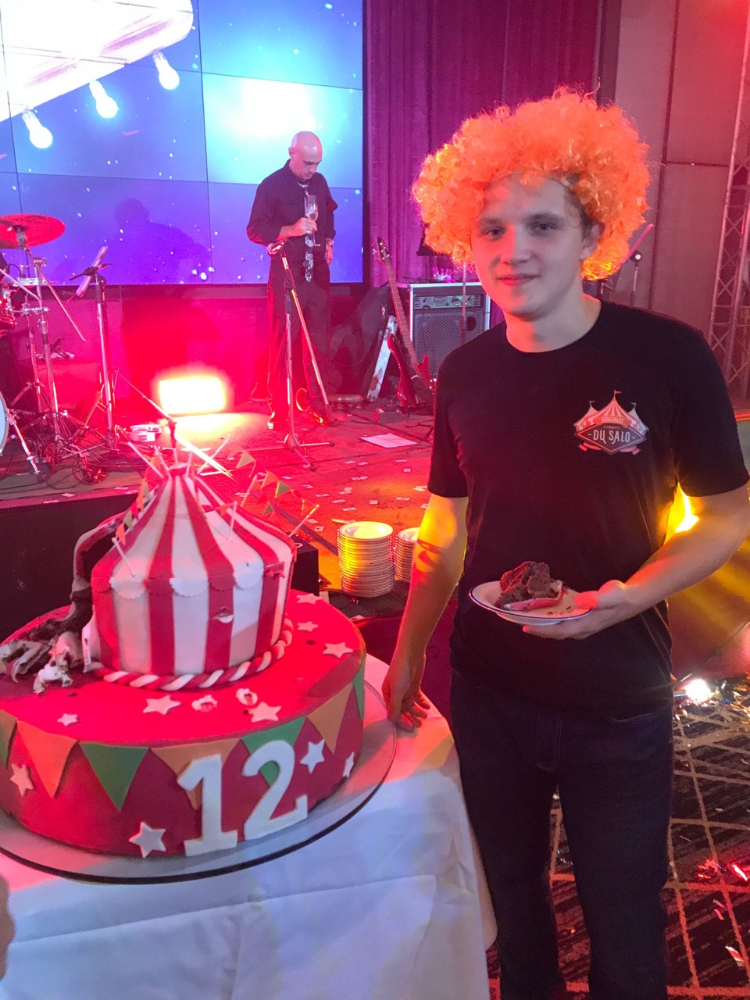

# 2019
## Цели
В начале года я записал то, что хочу сделать за этот год. Мало что из этого списка я сделал, поэтому просто напишу что сделал:

- Посмотрел <a href="/movies/">28 фильмов</a> в оригинале на английском с субтитрами на английском, думаю стал лучше понимать речь на слух, но в сложных фразах и речи с акцентом все еще смотрю в субтитры и переводчик.

- <a href="/books/">Книги</a>: прочел 2, прослушал 1.

- Хотел записывать скринкасты по программированию, чтобы самому лучше разобраться в темах и кому-то помочь, но в итоге написал только одну <a href="/articles/promises-asyncronous-js/">статью про промисы в JS.</a>

------
## Мой 2019 год

### Неопределенное и крутое время [начало года — 5 февраля]
28 декабря 2018 г. я вернулся из ШРИ Яндекса к семье в Бузулук.

Был очень рад встретиться с друзьями, которых давно не видел и встретить с ними новый год.

В это время я еще числился в колледже в Омске который не посещал с конца сентября, и до этого еще 5 месяцев почти не ходил.

После новогодних каникул мне пришлось вернуться в Омск. Это было неопределенное время для меня. Мне нужно было принять решение. С одной стороны осталось учиться 1.5 года, казалось бы немного, с другой стороны я не понимал зачем.

Я пару недель походил в колледж, и решил перестать туда ходить, это было нелегко. Но об этом решении я не жалею.

18 января я прошел финальное интервью в Яндекс по скайпу и меня позвали. :)

5 февраля. Вылетаю в Москву

### Яндекс. Москва [5 февраля — 19 мая]

Стажировка длилась 3 месяца, за это короткое время я круто прокачался в разработке, получил представление о том как выстроенны процессы в крупной компании, пообщался с крутыми ребятами.

Но из-за того что во время стажировки я распылялся на другую деятельность: ходил на тренинги, встречался с разными людьми (я хочу стать предпринимателем, меня привлекает возможность создавать что-то свое), я медленно решал рабочие задачи и меня не позвали работать дальше.

### Неопределенное время [май — август]
Я вернулся в Бузулук, жил с родителями и работал на фрилансе, не так просто было сосредоточится на работе в такой обстановке: рабочего места у меня не было, как и своей комнаты в которой можно закрыть дверь, через какое-то время я обустроил себе комнату, но это было так себе.

На фрилансе я переписывал сервис по поиску работы в сфере кафе и ресторанов на новые технологии. Я хорошо систематезировал свои навыки, получил опыт разработки проекта в одиночку почти с нуля. Мне очень повезло с человеком, который делал его вместе со мной, смотрел мой код, подсказывал. Спасибо, Паша.

### Прекрасное время [август — октябрь]
После этого я мгновенно уехал в Омск к своей девушке отдохнуть. Мы поехали в Казахстан и жили там неделю.

Озеро Боровое

Во время этих переездов [Сочи → Самара → Бузулук → Оренбург → Омск → Боровое] я умудрился сделать тестовое задание в Aviasales. :) Спасибо моей девушке за терпение и понимание. Я тратил на него то время, когда мы могли гулять, отдыхать и наслаждаться жизнью.

В это время я был почти «на мели», и меня приютил к себе мой друг, где я и жил до конца октября.

### Aviasales [конец года]
Впервые в Авиасейлс я написал еще в марте, когда работал в Яндексе. Тестовое получил только в августе. После того как сделал тестовое, выяснилось что меня не могут взять по юридическим причинам. Больше месяца я ждал решения этого вопроса. И он решился, я прошел собеседование и уже 20 октября я прилетел на Пхукет.

Закат у моря

Мне нравится в Авиасейлс, здесь свободная атмосфера, сильная команда, ребята помогают друг-другу в решении рабочих и личных вопросов, есть куча интересных и амбициозных задач, которые предстоит решить и многому научиться. :)

### Разные события года

- Через 1.5 месяца после прилета на Пхукет попал в небольшую аварию на байке. Отделался царапинами.

Мой байк у полиции

- Побывал в Малайзии (Куала-Лумпур) и Бангкоке на дне рождения Aviasales.

Aviasales 12 лет

- Посмотрел на солнечное затмение 26 декабря

### Заключение
Период неопределенности вроде закончился, чему я очень рад.

В новом году хочу заняться снова музыкой; сделать что-то большое и крутое в своей работе; побывать в нескольких странах, подумать какие больше нравится и почему, ну и просто посмотреть на мир; стабильно заниматься физкультурой (бегать хотя бы через день), проверить полностью здоровье, и быть счастливым. :)
