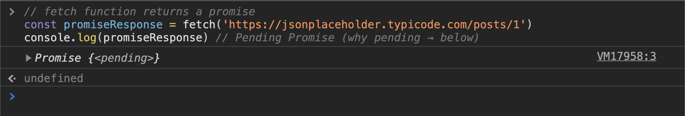
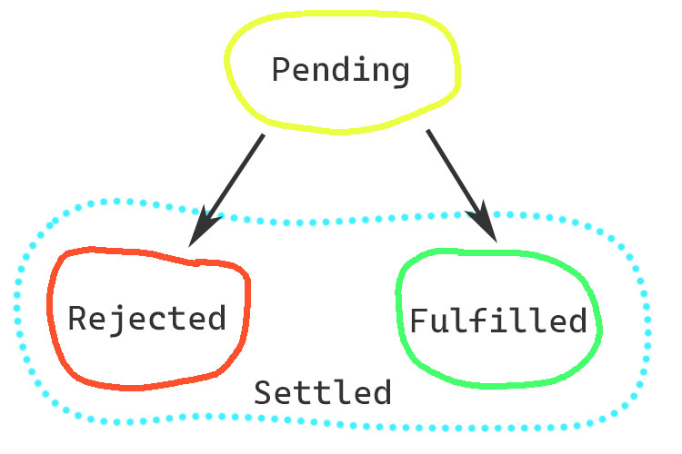
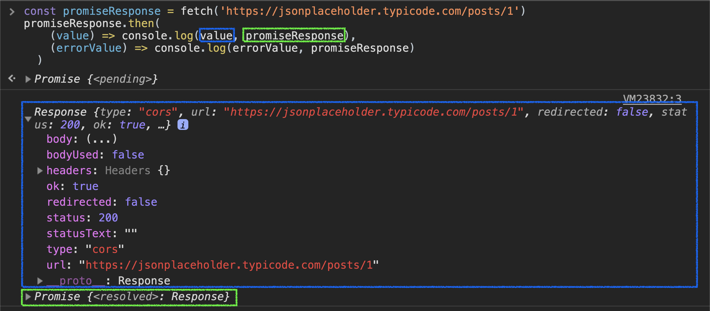
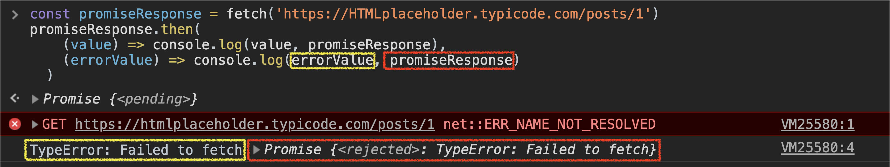
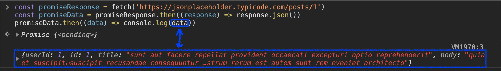

# Asynchronous JS. Promises By Example. Part 1

## 👋 Introduction
Hi! In this article, you'll learn how promises works, main concepts, syntax, how to use it to <a href="#fetch-data">fetch&nbsp;data</a>, <a href="#error-handling">handle&nbsp;errors</a>, nuances, and tricks of working with them. **(with examples!)**
<!--
Interesting fact: in computer science term `promise` was proposed in 1976, and early implementations of promises began to appear in languages
such as MultiLisp sometime in the 1980s. -->

In JavaScript native promises appeared in 2015 with `ES6` (or `ECMAScript2015`) standard and become one of the most important building blocks for asynchronous operations.

Promise's purpose — is to let us write asynchronous code conveniently.

*Before we dive in. If you are not familiar with promises I recommend you to open the browser's console and execute code examples in the article while reading to get a better understanding and feel the code.*

## 📝 Main Concepts
Asynchronous operations — is a JavaScript instructions that executes asynchronously, in other words — it takes some time for them to be completed and return a **value**, or failed and return an **error** *(they fail often)*.

Promise can help us to handle these operations. It's a special JavaScript object, that **has state** and **stores value**.

The promise can be returned synchronously from the asynchronous function.

For example: ↓
```js
// fetch function returns a promise
const promiseResponse = fetch('https://jsonplaceholder.typicode.com/posts/1')
console.log(promiseResponse) // Pending Promise (why pending → below)
```


<p class="signature">Pending promise in the console</p>

## 🤞 3 Possible Promise States

A bit theory for further more productive practice.

As I said before, the promise is a special JavaScript object, and this object **has the state**.


<p class="signature">Promise's possible states</p>

* before the result is ready — the promise's state is `pending` *(we already saw this)*
* when the result is available — the promise's state is `fulfilled`
* when an error happened — the promise's state is `rejected`

Once the promise is no longer `pending` (e.g. `fulfilled` or `rejected`), we say that promise has been `settled`.

*So, `settled` is not a special state, it's just a word to say that promise has settled with some state — `fulfilled` or `rejected`*

**Once the promise `settled`, it can no longer change its state**.

*There are new states we've learned — `fulfilled` and `rejected`. Let's take a look at them in the next section.*

## 👉 `then` Method
When our promise `fulfilled` or `rejected` — we can access the value from async operation.

But we can't do it synchronously 😐

There is where the `then` method comes in.
```ts
promise.then(
	onFulfilled?: Function,
	onRejected?: Function
) => Promise
```
<p class="signature"><code>then</code> signature<p>

`then` sets `onFulfilled` and `onRejected` functions as handlers for our promise.

<p class="highlight">These functions receive a value from async operation as a first argument.</p>

When async operation done — promise becomes `fulfilled` and first function will call.

```js
const promiseResponse = fetch('https://jsonplaceholder.typicode.com/posts/1')
promiseResponse.then(
    (value) => console.log(value, promiseResponse),
    (errorValue) => console.log(errorValue, promiseResponse)
  )
```


<p class="signature">Promise fulfilled in console</p>

*You might notice that browser call our `fulfilled` promise's state — `resolved`. You can think of it as `fulfilled`*

But if we made a typo in our address...

Promise will become `rejected` and second function will call.

```js
const promiseResponse = fetch('https://HTMLplaceholder.typicode.com/posts/1')
promiseResponse.then(
    (value) => console.log(value, promiseResponse),
    (errorValue) => console.log(errorValue, promiseResponse)
  )
```


<p class="signature">Promise rejected in console</p>

Note:

<p class="highlight"><code>then</code> returns the value that we returned from <code>onFulfilled</code> or <code>onRejected</code> function wrapepped into fulfilled promise.</p>

<p class="highlight">But if we return the promise — <code>then</code> returns this promise.</p>

<p class="highlight">If there is no handler for some promise state in <code>then</code> — <code>then</code> just will return promise on which this <code>then</code> method was called. For example: an error happened and there's no <code>onRejected</code> handler. In this case — <code>then</code> returns this rejected promise as it is.</p>

<h2 id="fetch-data">📦 Getting Data With <code>fetch</code></h2>

We want to get the response's body, so we need to parse it using the `json` method. This is also an async function that returns a promise.
```js
const promiseResponse = fetch('https://jsonplaceholder.typicode.com/posts/1')
promiseResponse.then(response => console.log(response.json())) // log pending promise
```
We already know how to deal with pending promises. Just add `then` to it
```js
const promiseResponse = fetch('https://jsonplaceholder.typicode.com/posts/1')
const promiseData = promiseResponse.then((response) => response.json())
promiseData.then((data) => console.log(data))
```

<p class="signature">Get async data</p>

Finally got the actual data in the console. 🥳

We can replace the last line to ↓ *(try it yourself!)*
```js
promiseData.then(console.log)
```
because `console.log` is a regular JavaScript function (like the ones we write in our code) that gets infinite number of arguments and log them to the console. In our case there is only one argument and works nicely.

<h2 id="error-handling">⚠️ Error Handling</h2>

Because asynchronous operations fail all the time.

We already handled an error in *`then` method* section

We can handle errors with `then(null, onRejected)` and `catch(onRejected)`.

<p class="highlight"><code>catch(onRejected)</code> is equivalent and shorthand for <code>then(null, onRejected)</code>.</p>

```js
const promiseResponse = fetch('https://HTMLplaceholder.typicode.com/posts/1') // TYPO!
const promiseData = promiseResponse.then((response) => response.json())
const data = promiseData.then(console.log)
data.then(null, (errorValue) => console.log(errorValue, 'catched here!'))
```
<p class="signature">catched error in promise</p>

Try to replace `then(null, onRejected)` with `catch(onRejected)`.

*Note: we write `onRejected` handler on the last promise to handle all possible errors that can happened from the first promise to the last.*

All right! Let's talk about fetching data as most common async operation case. What if our operation done successfully, but server responded with error? In promise terms, our async operation done well and promise will be fulfilled. Let's learn how we can handle this!

```js
const promiseResponse = fetch('https://jsonplaceholder.typicode.com/posts/99999999')
// server responds with 404 error
const promiseData = promiseResponse
  .then((response) => {
      if (!response.ok) throw Error('whoops!')
      response.json()
    })
const data = promiseData.then(console.log)
data.then(null, (errorValue) => console.log(errorValue, 'catched here!'))
// ... rewrite last line with catch
```

Here we check `ok` flag. As we already know, `then` returns what we return from handler function
<p class="highlight">Throwing something <em>synchronously</em> (in this case — Error) is the same as if we would returned a rejected promise.</p>

By the way, we can create one already rejected with `Promise.reject()`. Behaviour will be the same. *Try this! And don't forget to return it!*

## ⛓ Promise Chain With `then` Method
Take a look at the code we've got on the previous step:
```js
const promiseResponse = fetch('https://jsonplaceholder.typicode.com/posts/99999999')
const promiseData = promiseResponse
  .then((response) => {
      if (!response.ok) return Promise.reject('whoops!')
      response.json()
    })
const data = promiseData.then(console.log)
data.catch((errorValue) => console.log(errorValue, 'catched here!'))
```
Let's get rid of temporary variables. We can just add `then`s to the `fetch` and other `then`s because both them return the promise.
```js
fetch('https://jsonplaceholder.typicode.com/posts/99999999')
  .then((response) => {
    if (!response.ok) return Promise.reject('whoops!')
    response.json()
  })
  .then(console.log)
  .catch((errorValue) => console.log(errorValue, 'catched here!'))
```

Note how our promises «chains» one to another, this thing called **promise chain**! 🎉

<p class="highlight">In the second <code>then</code> there is no <code>onRejected</code> handler, so <code>then</code> just returns rejected promise as it is. That's why we successfully handle promise in the next <code>catch</code>.</p>

## 🧱 Promise creation
Previously, we used the built-in browser function `fetch` to get a promise, that will be `fulfilled` or `rejected` after some time. We can create our own using Promise Constructor!

Take a look at its signature ↓
```ts
new Promise((resolve?: Function, reject?: Function) => any)
```
<p class="signature">promise constructor signature</p>

We provide a function to the constructor, this function receives two arguments (the name is up to you), both — functions. We can call them with only one argument — promise value, it will be the value we will get in our handlers `onFulfilled` and `onRejected`. We can call them to make our promise `settled`. `resolve` — to make the promise `fulfilled`, `reject` — to make the promise `rejected`.

Try to write promise that will be `fulfilled` after 1 second
```js
const myPromise = new Promise((resolve, reject) => setTimeout(() => resolve('wee, success! :)'), 1000))
myPromise.then(alert)
```
Try the same with reject and `catch`

We can also create already fulfilled promises — `Promise.resolve()`, and rejected — `Promise.reject()` with optional value.

<!-- ## 🏁`finally` Method Use Case
As `then` and `catch` we can use the `finally` method with promises.
`promise.finally(Function)`
finally signature

The function we passed into `finally` will be executed once the promise is settled (`fulfilled` or `rejected`).

It can be used to remove the loading state in our app when loading some data: ↓
```js
fetch('https://heavy.data')
	.then(response => response.json())
	.then(data => displayOurData)
	.catch(error => showErrorToUser(error))
	.finally(removeLoadingStateForExampleSpinner)
```
Check out real example on <a target="_blank" href="https://jsfiddle.net/ajmdag/xpmnc1k7/30/">jsfiddle</a> -->


## Topics not covered
1. `finally` method example
2. Promises with `async/await`
3. Work with multiple promises (`Promise.race`, `Promise.all`)
4. Exciting code tasks, more examples
5. Your proposals, improvements, and comments are appreciated!🎉 → [Telegram](https://t.me/ajmdag/ "Telegram") [yurka7321@gmail.com](mailto:yurka7321@gmail.com "E-mail")
