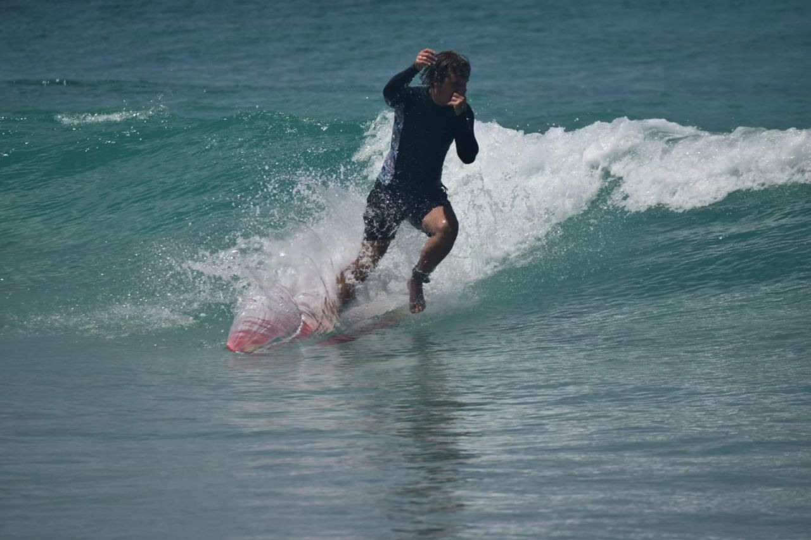
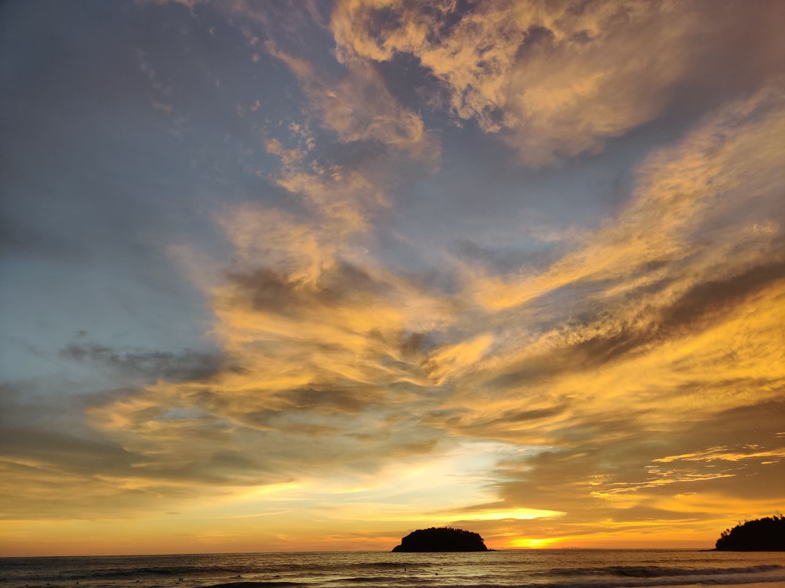
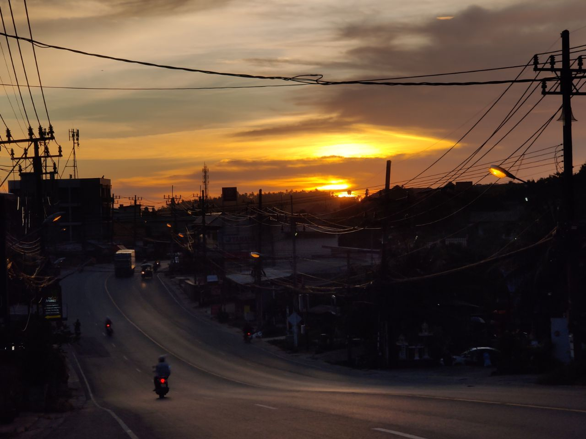

# Year in Aviasales

It's been a year since I moved to Thailand🇹🇭 and started a new job at <a target="_blank" href="https://aviasales.com/">Aviasales</a>. We live in Phuket and have an office here.

It's been a good year. I've learned about life in another country, it was a completely new experience for me. People are not as different from country to country as they might seem. The company and people from there gave me a lot. It's cool to be surrounded by smart people. During the year I've done a several things for the company that I'm proud of.

I like to live in Thailand.

I discovered surfing as a very exciting sport.

Surfing is cool! 🤙🏼

Since we live on the island surrounded by the sea, I have an opportunity to surf almost every day 🙃.

## Notes for Myself
When you are bored: remember the feeling of doing something glorious and remarkable, something that changes your life. Focus on finding those actions — effective actions you can tackle.

Do not rely on others opinions much, learn things by yourself.

Only you decide what your future will look like. It's your decision. _(<a href="https://en.wikipedia.org/wiki/Stoicism" target="_blank">Stoicism</a>)_

Do not be afraid of changes and uncertainty. These are integral parts of life. Take care of yourself, breathe easily, focus, act.

## Pictures at the End

